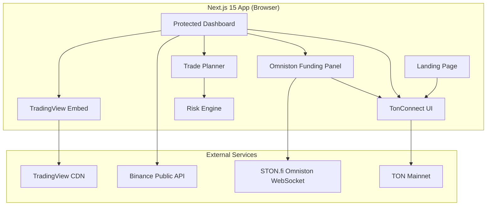
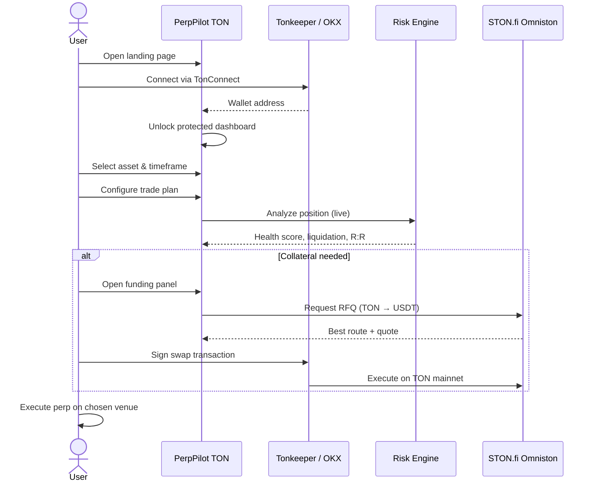

# PerpPilot TON

**Professional perpetual risk terminal for TON traders** — built for the [STON.fi Vibe Coding Hackathon](https://ston.fi).

**Live demo:** [perp-pilot-ton.vercel.app](https://perp-pilot-ton.vercel.app)

---

## What it is (and isn't)

PerpPilot TON is **not** a perpetual exchange. It is an upstream **risk-analysis, trade-planning, and collateral-funding terminal** that helps traders evaluate positions *before* they commit capital on-chain.

| PerpPilot does | PerpPilot does not |
|----------------|-------------------|
| Model liquidation price & margin buffer | Execute perpetual trades |
| Score position health in real time | Custody user funds |
| Plan entries with R:R and stop-loss | Replace your exchange |
| Fund USDT collateral via STON.fi Omniston | Mock swap quotes |

---

## Key features

### Landing
- Hero with WebGL lightning shader and hue control
- Radial orbital platform timeline
- Crypto ecosystem marquee
- Scrolling testimonials
- TonConnect wallet connect (Tonkeeper, OKX Wallet, etc.)

### Dashboard (wallet-gated)
- **TradingView Advanced Chart** — indicators, drawings, timeframes, volume
- **Trade planner** — leverage, collateral, entry, stop-loss, take-profit
- **Live risk engine** — health score, liquidation distance, margin utilization, PnL scenarios
- **Omniston collateral funding** — real RFQ routes, slippage protection, TonConnect signing

---

## Architecture



---

## User flow



---

## Tech stack

| Layer | Technology |
|-------|------------|
| Framework | Next.js 15 (App Router), React 19, TypeScript |
| Styling | Tailwind CSS v4, shadcn/ui, Framer Motion |
| State | Zustand |
| Forms | React Hook Form + Zod |
| Charts | TradingView Advanced Chart embed, Binance ticker data |
| Wallet | TON AppKit, TonConnect UI (`@tonconnect/ui-react`) |
| Swaps | `@ston-fi/omniston-sdk` v0.8.1 + React bindings |
| Testing | Vitest (risk engine unit tests) |

---

## Project structure

```
src/
├── app/                      # Routes: / (landing), /dashboard
├── components/
│   ├── chart/                # TradingView, toolbar, market header
│   ├── dashboard/            # TradingTerminal layout
│   ├── landing/              # Hero, testimonials, marquee, footer
│   ├── layout/               # TopNav, ProtectedDashboardLayout
│   ├── navigation/           # Sidebar
│   ├── omniston/             # Funding panel, swap UI, route details
│   ├── risk/                 # Health gauge, metrics, overview
│   ├── trade-planner/        # Trade plan form panel
│   ├── ui/                   # shadcn primitives + custom UI blocks
│   └── wallet/               # WalletProvider, connect button
├── hooks/                    # Chart data, risk analysis, Omniston, wallet
├── lib/
│   ├── chart/                # Assets, timeframes, TradingView config
│   ├── omniston/             # Client, quotes, routes, settlement
│   ├── risk-engine/          # Position analysis (pure TypeScript)
│   ├── tonconnect/           # Manifest URL, AppKit singleton
│   └── trade-planner/        # Zod schema, risk input builder
├── store/                    # chart-store, wallet-store
└── types/                    # Shared TypeScript types

public/
├── tonconnect-manifest.json  # TonConnect app manifest (production URLs)
└── icon.png                  # App icon for wallet manifest
```

---

## Getting started

### Prerequisites
- Node.js 20+
- npm
- A TON wallet (Tonkeeper recommended)

### Install & run

```bash
git clone https://github.com/sainath5001/PerpPilot_TON.git
cd PerpPilot_TON
npm install
npm run dev
```

Open **http://localhost:3000** → connect wallet → access `/dashboard`.

> **WSL users:** `npm run dev` binds to `localhost:3000` (required for TonConnect). See `scripts/dev.sh` for alternate URLs if localhost fails from Windows.

### Scripts

| Command | Description |
|---------|-------------|
| `npm run dev` | Start dev server on `localhost:3000` |
| `npm run build` | Production build |
| `npm run start` | Start production server |
| `npm run lint` | Run ESLint |
| `npm test` | Run risk engine unit tests (Vitest) |
| `npm run test:watch` | Vitest watch mode |

---

## Risk engine

Pure TypeScript module at `src/lib/risk-engine/`. No React dependencies — fully unit-tested.

**Inputs:** collateral, leverage, entry price, direction (long/short), optional stop-loss & take-profit.

**Outputs:**
- Position size (notional & base)
- Liquidation price & distance
- Margin utilization & buffer
- Potential PnL at TP/SL
- Risk/reward ratio
- **Health score** (0–100) with risk level

```bash
npm test
```

---

## Wallet & TonConnect

TonConnect requires a publicly accessible manifest. Production is configured for:

| Resource | URL |
|----------|-----|
| App URL | `https://perp-pilot-ton.vercel.app` |
| Manifest | `https://perp-pilot-ton.vercel.app/tonconnect-manifest.json` |
| Icon | `https://perp-pilot-ton.vercel.app/icon.png` |

Config lives in:
- `public/tonconnect-manifest.json` — static manifest served by Next.js
- `src/lib/tonconnect/client.ts` — `TON_CONNECT_APP_ORIGIN` + manifest URL

If you deploy to a **different domain**, update both files before going live. Tonkeeper will reject manifests with `localhost` URLs.

---

## Omniston integration

Collateral funding uses the official **STON.fi Omniston SDK** — not mocks.

1. User sets required USDT collateral in the trade planner
2. Funding panel requests live RFQ over Omniston WebSocket
3. Route breakdown and slippage preview are shown
4. User signs the swap via TonConnect (non-custodial)
5. Swap settles on TON mainnet (TON → USDT)

SDK: `@ston-fi/omniston-sdk@0.8.1`

---

## Deployment

Deploy to [Vercel](https://vercel.com) (or any Node host):

```bash
npm run build
```

**Checklist before production:**
- [ ] `public/tonconnect-manifest.json` uses your production domain
- [ ] `src/lib/tonconnect/client.ts` `TON_CONNECT_APP_ORIGIN` matches
- [ ] `public/icon.png` is accessible at `{origin}/icon.png`
- [ ] Verify manifest in browser after deploy

---

## Environment

No `.env` file is required for the current build. Chart data uses public Binance endpoints; Omniston connects to STON.fi infrastructure; wallet uses TonConnect.

---

## License

Private — hackathon submission. See repository owner for usage terms.
